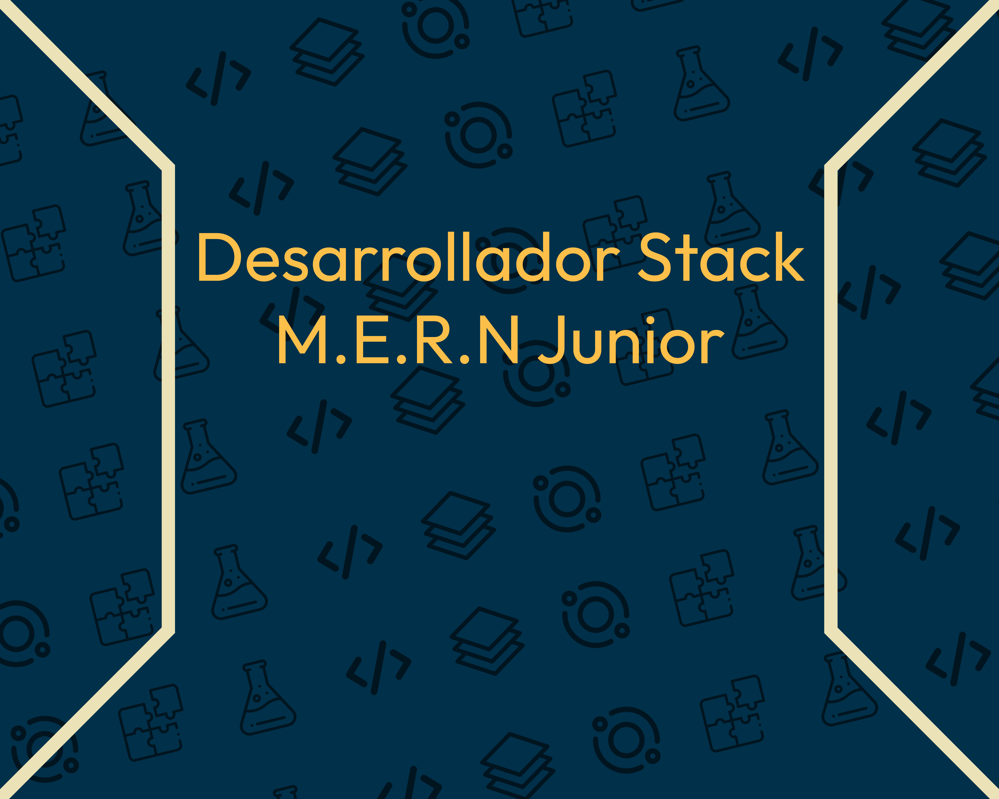

<h1 align="center">Hola 👋! Yo soy Tomas Emilio Avila</h1>
<h3 align="center">Soy un desarrollador stack MERN, de nivel junior. Mi objetivo antes de los 18 es haber creado una gran cantidad de proyectos y soluciones que beneficien al usuario, que pueda cuburir una necesidad. Actualmente soy Autodidacta, por lo tanto mi aprendizaje y mis proyectos no son muy completos o su produccion es lenta pero me alegra aprender y mostrar mis conocimientos</h3>

  

  

- Este fue uno de mis primeros proyectos mas pesados que hice en mis inicios, se trata de una pagina web de tokens [WebToken](https://tvblockchain.000webhostapp.com/index.html)

- Esta es una pagina mas basica probando frameworks como tailwindcss, su funcion es mostrar libros [DTAW](https://inversionesconintel.000webhostapp.com/)

<h3 align="left">Connect with me:</h3>

<h3 align="left">Languages and Tools:</h3>

                             

&nbsp;

